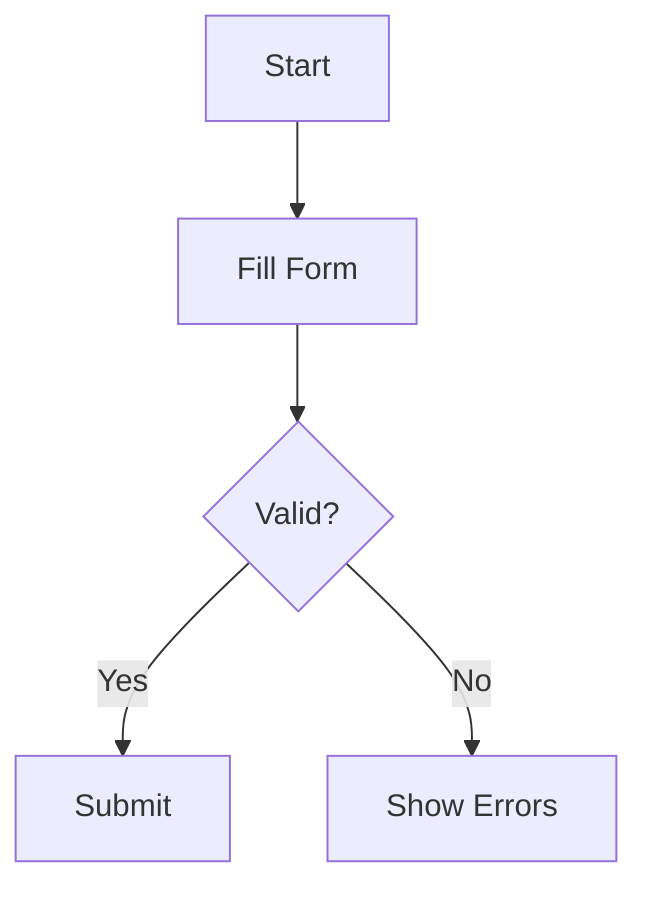

# PRD Agent - Complete Project Flow Documentation

**Version:** 2.0  
**Last Updated:** February 11, 2026  
**Purpose:** Comprehensive documentation of the entire PRD Agent system flow from start to finish

---

## Table of Contents

1. [Executive Summary](#1-executive-summary)
2. [System Architecture](#2-system-architecture)
3. [Entry Points & Initialization](#3-entry-points--initialization)
4. [Complete Flow: PRD Generation](#4-complete-flow-prd-generation)
5. [Complete Flow: Agentic Code Migration](#5-complete-flow-agentic-code-migration)
6. [Core Components Deep Dive](#6-core-components-deep-dive)
7. [Data Flow & Interactions](#7-data-flow--interactions)
8. [Configuration & Setup](#8-configuration--setup)
9. [Output & Results](#9-output--results)
10. [Monitoring & Observability](#10-monitoring--observability)

---

## 1. Executive Summary

### 1.1 What is PRD Agent?

PRD Agent is an **AI-powered Product Requirements Document generation and code migration system** that:

- **Analyzes legacy codebases** (Java/Swing/Oracle) to extract business logic, data models, and UI patterns
- **Generates comprehensive PRDs** with detailed specifications, data models, API docs, and user flows
- **Creates a searchable vector knowledge base** using Qdrant for semantic code search
- **Migrates legacy code to modern frameworks** (.NET Core + React) using AI agents with tool-calling capabilities
- **Orchestrates workflows** using Temporal for enterprise-grade reliability and fault tolerance

### 1.2 Key Capabilities

| Capability                   | Description                                                                      |
| ---------------------------- | -------------------------------------------------------------------------------- |
| **Multi-Source Analysis**    | Extracts insights from code, UI screenshots, database schemas, and documentation |
| **Agentic Code Migration**   | AI agents that reason like developers using tools to generate modern code        |
| **Vector Knowledge Base**    | Semantic search over code, docs, and schemas using OpenAI embeddings + Qdrant    |
| **Smart Caching**            | PostgreSQL-based caching for LLM responses, vector searches, and tool results    |
| **Workflow Orchestration**   | Temporal workflows with retries, fault tolerance, and state management           |
| **Comprehensive PRD Output** | 15+ section PRD with diagrams, API specs, and migration guides                   |

### 1.3 Technology Stack

```
┌─────────────────────────────────────────────────────────────┐
│                     PRD Agent System                        │
├─────────────────────────────────────────────────────────────┤
│  LLM Layer                                                  │
│  ├─ Anthropic Claude Sonnet 4.5 (reasoning & code gen)     │
│  └─ OpenAI GPT-4o (vision & fallback)                      │
├─────────────────────────────────────────────────────────────┤
│  Storage Layer                                              │
│  ├─ Qdrant (vector embeddings & semantic search)           │
│  ├─ PostgreSQL (caching & Temporal state)                  │
│  └─ MinIO (object storage for docs/screenshots)            │
├─────────────────────────────────────────────────────────────┤
│  Orchestration Layer                                        │
│  └─ Temporal (workflow execution & fault tolerance)        │
├─────────────────────────────────────────────────────────────┤
│  Application Layer                                          │
│  ├─ Python 3.11+ (core application)                        │
│  ├─ Typer (CLI interface)                                  │
│  └─ AsyncIO (concurrent operations)                        │
└─────────────────────────────────────────────────────────────┘
```

---

## 2. System Architecture

### 2.1 High-Level Architecture Diagram

```
┌──────────────────────────────────────────────────────────────────┐
│                         User Interface                           │
│                     (CLI - Typer Commands)                       │
└────────────────────────────┬─────────────────────────────────────┘
                             │
                             ▼
┌──────────────────────────────────────────────────────────────────┐
│                    Workflow Orchestration                        │
│                     (Temporal Workflows)                         │
│  ├─ PRD Generation Workflow                                     │
│  └─ Migration Orchestration Workflow                            │
└────────────────────────────┬─────────────────────────────────────┘
                             │
        ┌────────────────────┼────────────────────┐
        │                    │                    │
        ▼                    ▼                    ▼
┌───────────────┐  ┌───────────────────┐  ┌──────────────────┐
│  Extraction   │  │   AI Agents       │  │  Vector Store    │
│  Pipeline     │  │   Layer           │  │  Layer           │
│               │  │                   │  │                  │
│  ├─ Code      │  │  ├─ PRD Agents    │  │  ├─ Qdrant      │
│  ├─ MinIO     │  │  │  ├─ Screenshot │  │  ├─ Embeddings  │
│  └─ PRD       │  │  │  ├─ Req Gen    │  │  └─ Search      │
│               │  │  │  ├─ User Flow  │  │                  │
│               │  │  │  ├─ DB Analysis│  │                  │
│               │  │  │  └─ Aggregator │  │                  │
│               │  │  │                │  │                  │
│               │  │  └─ Migration     │  │                  │
│               │  │     Agents        │  │                  │
│               │  │     ├─ Orchestr.  │  │                  │
│               │  │     ├─ Backend    │  │                  │
│               │  │     ├─ Frontend   │  │                  │
│               │  │     └─ Database   │  │                  │
└───────────────┘  └───────────────────┘  └──────────────────┘
                             │
                             ▼
┌──────────────────────────────────────────────────────────────────┐
│                    Tool System & Utilities                       │
│  ├─ File Tools (read/write/list/find)                          │
│  ├─ Code Tools (search/context/business logic)                 │
│  ├─ Database Tools (schema/mappings/relationships)             │
│  └─ MinIO Tools (docs/templates/screenshots)                   │
└──────────────────────────────────────────────────────────────────┘
                             │
                             ▼
┌──────────────────────────────────────────────────────────────────┐
│                      Storage & Cache Layer                       │
│  ├─ PostgreSQL (LLM cache, vector search cache, tool cache)    │
│  ├─ Qdrant (vector embeddings & semantic search)               │
│  └─ MinIO (documents, screenshots, templates, code)            │
└──────────────────────────────────────────────────────────────────┘
```

### 2.2 Component Layers

| Layer                 | Components                                             | Responsibility                                               |
| --------------------- | ------------------------------------------------------ | ------------------------------------------------------------ |
| **CLI**               | `src/cli/commands.py`, `src/main.py`                   | User interface, command parsing, input validation            |
| **Workflows**         | `src/workflows/prd_generation_workflow.py`, Activities | Temporal orchestration, fault tolerance, state management    |
| **Agents**            | `src/core/prd/`, `src/core/migration/`                 | AI-powered analysis, code generation, reasoning              |
| **Agentic Framework** | `src/core/agentic/`                                    | Agent base class, runner, message history, tool registry     |
| **Tools**             | `src/tools/`                                           | File operations, code search, database queries, MinIO access |
| **Extractors**        | `src/extractors/`                                      | Data extraction from various sources (code, MinIO, PRDs)     |
| **Vector Store**      | `src/vector_store/`                                    | Qdrant management, embeddings, semantic search               |
| **Cache**             | `src/utils/cache_manager.py`                           | PostgreSQL caching for LLM, vectors, and tool results        |
| **Config**            | `src/config/settings.py`                               | Centralized configuration management                         |
| **Prompts**           | `src/prompts/`                                         | LLM prompt templates and loading                             |

---

## 3. Entry Points & Initialization

### 3.1 Main Entry Point

**File:** `src/main.py`

```python
def main():
    """Entry point for the PRD Agent CLI"""
    run_cli()  # Calls src/cli/commands.py
```

### 3.2 CLI Commands (Typer App)

**File:** `src/cli/commands.py`

All user interactions start here:

```bash
# Command Structure
prd-agent <command> [options]

# Available Commands:
├─ generate              # Generate PRD from legacy code
├─ migrate-agentic       # Migrate code using AI agents
├─ search                # Search knowledge base
├─ list-collections      # List vector collections
├─ stats                 # Get collection statistics
├─ delete-collection     # Delete collection and data
├─ cache-stats           # View cache statistics
├─ cache-clear           # Clear cache entries
├─ create-minio-folders  # Setup MinIO folder structure
├─ create-form-folders   # Create form-specific folders
└─ version               # Show version info
```

### 3.3 Temporal Worker Entry Point

**File:** `src/worker/temporal_worker.py`

```python
async def main():
    """Start Temporal worker"""
    worker = await run_worker()
    # Registers workflows: PRDGenerationWorkflow
    # Registers activities: extraction, storage, analysis, aggregation
```

**Worker must be running** for `prd-agent generate` command to work.

### 3.4 Initialization Flow

```
User runs: prd-agent generate -f le11 -o ./output
    │
    ├─> CLI parses arguments (commands.py)
    │
    ├─> Validates form name, output directory
    │
    ├─> Connects to Temporal server (localhost:7233)
    │
    ├─> Creates PRDGenerationInput dataclass
    │   ├─ form_name: str
    │   ├─ output_dir: Path
    │   ├─ zip_path: Optional[Path]
    │   └─ code_dir: Optional[Path]
    │
    └─> Executes PRDGenerationWorkflow via Temporal
```

---

## 4. Complete Flow: PRD Generation

### 4.1 Overview

The PRD generation process is orchestrated by a **Temporal workflow** that coordinates multiple activities across 8 phases:

```
Input: Form name (e.g., "le11") + Optional code source
   ↓
Output: Comprehensive PRD document (15+ sections)
```

### 4.2 Detailed Phase-by-Phase Flow

#### **Phase 1: Data Extraction**

**Duration:** ~30-60 seconds  
**Activities:** 4 parallel extraction activities

```
┌─────────────────────────────────────────────────────────────┐
│ PHASE 1: Data Extraction                                    │
│ File: src/workflows/activities/extraction.py                │
└─────────────────────────────────────────────────────────────┘

Parallel Extraction:
├─ extract_code_activity
│  ├─ Source: ZIP file, directory, or MinIO (LEGACY_CODEBASE/)
│  ├─ Extracts: Java files, configs, resources
│  ├─ Filters: Business logic, DAOs, models, controllers
│  └─ Output: List of CodeFile objects
│
├─ extract_screenshots_activity
│  ├─ Source: MinIO (FORMS/{form_name}/UI_SCREENSHOTS/)
│  ├─ Fetches: PNG/JPG screenshots
│  ├─ Downloads: To temp directory
│  └─ Output: List of screenshot paths
│
├─ extract_existing_prd_activity
│  ├─ Source: MinIO (FORMS/{form_name}/FORM_DOCS/)
│  ├─ Fetches: Markdown documentation, specs
│  ├─ Reads: .md, .txt files
│  └─ Output: PRDDocument objects
│
└─ extract_db_prd_activity
   ├─ Source: MinIO (DB_PRD/)
   ├─ Fetches: Schema docs, mappings, relationships
   ├─ Reads: Database documentation
   └─ Output: DBPRDDocument objects
```

**Key Files:**

- `src/extractors/code_extractor.py` - Extracts Java code
- `src/extractors/minio_extractor.py` - Fetches from MinIO
- `src/extractors/prd_extractor.py` - Parses existing PRDs

**Output:**

```python
ExtractionResult(
    code_files=[...],          # ~100-500 Java files
    screenshots=[...],         # ~10-50 images
    existing_prds=[...],       # ~5-20 documents
    db_prds=[...]             # ~3-10 schema docs
)
```

---

#### **Phase 2: Vector Storage (Knowledge Base Creation)**

**Duration:** ~2-5 minutes  
**Activity:** `store_vectors_activity`

```
┌─────────────────────────────────────────────────────────────┐
│ PHASE 2: Vector Storage                                     │
│ File: src/workflows/activities/storage.py                   │
└─────────────────────────────────────────────────────────────┘

Process:
1. Create Qdrant Collection
   ├─ Collection name: "{form_name}_prd"
   ├─ Vector size: 3072 (OpenAI text-embedding-3-large)
   └─ Distance: Cosine similarity

2. Process Code Files
   ├─ Chunk size: ~1000 tokens
   ├─ Extract: Methods, classes, business logic
   ├─ Metadata: {file_path, class_name, method_name, doc_type}
   ├─ Generate embeddings (OpenAI)
   └─ Store in Qdrant

3. Process Documentation
   ├─ Chunk existing PRDs by sections
   ├─ Metadata: {doc_type: "existing_prd", source}
   └─ Store in Qdrant

4. Process Database Docs
   ├─ Parse schema, relationships, mappings
   ├─ Metadata: {doc_type: "database", table_name}
   └─ Store in Qdrant

5. Process Screenshots (later in Phase 3)
   └─ Store analysis results with metadata
```

**Key Files:**

- `src/vector_store/qdrant_manager.py` - Qdrant operations
- `src/vector_store/embeddings.py` - OpenAI embeddings
- `src/utils/business_logic_extractor.py` - Code analysis

**Output:**

```
Knowledge Base Created:
├─ Collection: "le11_prd"
├─ Vectors: ~1,000-5,000 entries
├─ Types:
│  ├─ code (500-2000)
│  ├─ business_logic (200-800)
│  ├─ existing_prd (100-300)
│  └─ database (50-200)
└─ Searchable: Yes (semantic search ready)
```

---

#### **Phase 3: Initial Analysis (Screenshot Analysis)**

**Duration:** ~1-3 minutes  
**Activity:** `analyze_screenshots_activity`

```
┌─────────────────────────────────────────────────────────────┐
│ PHASE 3: Screenshot Analysis                                │
│ File: src/workflows/activities/analysis.py                  │
│ Agent: ScreenshotAnalysisAgent (GPT-4 Vision)               │
└─────────────────────────────────────────────────────────────┘

Process:
1. Load Screenshots
   └─ Read from temp directory

2. For Each Screenshot:
   ├─ Call GPT-4 Vision API
   ├─ Analyze:
   │  ├─ UI Components (buttons, inputs, tables, etc.)
   │  ├─ Layout structure
   │  ├─ Form fields and labels
   │  ├─ Validation hints (required fields, formats)
   │  ├─ Navigation elements
   │  └─ Data relationships
   └─ Generate description

3. Aggregate Results
   ├─ Combine all screenshot analyses
   ├─ Extract common patterns
   └─ Create comprehensive UI documentation
```

**Key Files:**

- `src/core/prd/screenshot_analysis_agent.py`
- `src/prompts/txt/screenshot_analysis/`

**Output:**

```python
ScreenshotAnalysisResult(
    ui_components=[...],       # List of identified components
    layout_description="...",  # Overall layout structure
    form_fields=[...],         # Extracted form fields
    validation_rules=[...],    # Identified validation patterns
    navigation_flow="...",     # Navigation structure
    recommendations=[...]      # UI/UX recommendations
)
```

---

#### **Phase 4: Requirements Generation**

**Duration:** ~3-5 minutes  
**Activity:** `generate_requirements_activity`

```
┌─────────────────────────────────────────────────────────────┐
│ PHASE 4: Requirements Generation                            │
│ File: src/workflows/activities/analysis.py                  │
│ Agent: RequirementsGeneratorAgent (Claude Sonnet 4.5)       │
└─────────────────────────────────────────────────────────────┘

Process:
1. Retrieve Context from Knowledge Base
   ├─ Search for business logic (doc_type: business_logic)
   ├─ Search for data models (doc_type: code)
   ├─ Search for existing requirements (doc_type: existing_prd)
   └─ Top 20-30 relevant chunks

2. Generate Requirements
   ├─ Functional Requirements
   │  ├─ Core functionality
   │  ├─ User interactions
   │  ├─ Data operations (CRUD)
   │  └─ Integration points
   │
   ├─ Non-Functional Requirements
   │  ├─ Performance (response times)
   │  ├─ Security (auth, authorization)
   │  ├─ Scalability
   │  └─ Reliability
   │
   ├─ Data Models
   │  ├─ Entity definitions
   │  ├─ Field specifications
   │  ├─ Relationships
   │  └─ Constraints
   │
   ├─ API Specifications
   │  ├─ Endpoints (GET, POST, PUT, DELETE)
   │  ├─ Request/response schemas
   │  ├─ Error handling
   │  └─ Authentication
   │
   └─ Validation Rules
      ├─ Field validations
      ├─ Business rule validations
      └─ Cross-field validations

3. Structure Output
   └─ Markdown formatted requirements document
```

**Key Files:**

- `src/core/prd/requirements_generator_agent.py`
- `src/prompts/txt/requirements/`

**Output:**

```markdown
# Functional Requirements

## FR-1: Core Functionality

...

# Data Model

## Entity: Application

- id: UUID (Primary Key)
- application_number: String (Unique)
  ...

# API Specifications

## POST /api/applications

...
```

---

#### **Phase 5: User Flow Analysis**

**Duration:** ~2-4 minutes  
**Activity:** `analyze_user_flows_activity`

```
┌─────────────────────────────────────────────────────────────┐
│ PHASE 5: User Flow Analysis                                 │
│ File: src/workflows/activities/analysis.py                  │
│ Agent: UserFlowAgent (Claude Sonnet 4.5)                    │
└─────────────────────────────────────────────────────────────┘

Process:
1. Identify Actors
   ├─ User roles (Admin, Applicant, Reviewer, etc.)
   └─ External systems

2. Map User Journeys
   ├─ Entry points
   ├─ Step-by-step flow
   ├─ Decision points
   ├─ Error paths
   └─ Exit points

3. Generate Mermaid Diagrams
   ├─ Flowchart syntax
   ├─ Visual representation
   └─ Embedded in markdown

4. Document Workflows
   ├─ State transitions
   ├─ Business rules at each step
   └─ Integration touchpoints
```

**Key Files:**

- `src/core/prd/user_flow_agent.py`
- `src/prompts/txt/user_flow/`

**Output:**

````markdown
# User Flows

## Flow 1: Application Submission

### Actors

- Applicant (Primary)
- System (Secondary)

### Steps

1. User navigates to application form
2. User fills required fields
3. System validates input
   ...

### Mermaid Diagram


````

```

---

#### **Phase 5.5: Store Analysis Results**

**Duration:** ~30-60 seconds
**Activity:** `store_analysis_results_activity`

```

┌─────────────────────────────────────────────────────────────┐
│ PHASE 5.5: Store Analysis Results in Knowledge Base │
│ File: src/workflows/activities/storage.py │
└─────────────────────────────────────────────────────────────┘

Process:

1. Store Screenshot Analysis
   ├─ Metadata: {doc_type: "screenshot_analysis"}
   └─ Enable agents to reference UI insights

2. Store Requirements
   ├─ Metadata: {doc_type: "generated_requirements"}
   └─ Enable cross-referencing in aggregation

3. Store User Flows
   ├─ Metadata: {doc_type: "user_flow"}
   └─ Enable workflow context retrieval

```

---

#### **Phase 5.9: Database Analysis**

**Duration:** ~2-4 minutes
**Activity:** `analyze_database_activity`

```

┌─────────────────────────────────────────────────────────────┐
│ PHASE 5.9: Database Analysis │
│ File: src/workflows/activities/analysis.py │
│ Agent: DatabaseAnalysisAgent (Claude Sonnet 4.5) │
└─────────────────────────────────────────────────────────────┘

Process:

1. Retrieve Database Context
   ├─ Search for schema docs (doc_type: database)
   ├─ Search for table mappings
   └─ Search for queries in code

2. Analyze Form-Specific Tables
   ├─ Identify primary tables
   ├─ Map relationships (FK, 1:M, M:M)
   ├─ Document fields and types
   └─ Extract constraints

3. Document Queries
   ├─ Extract SQL from code
   ├─ Analyze data access patterns
   └─ Document stored procedures

4. Create Migration Mappings
   ├─ Legacy → Modern field mappings
   ├─ Oracle → PostgreSQL type conversions
   └─ Data transformation rules

````

**Key Files:**
- `src/core/prd/database_analysis_agent.py`
- `src/prompts/txt/database_analysis/`
- `src/utils/sql_parser.py`

**Output:**
```markdown
# Database Analysis

## Primary Tables

### APPLICATIONS
- ID (NUMBER(10)) → PK
- APPLICATION_NUMBER (VARCHAR2(20)) → UNIQUE
...

## Relationships
APPLICATIONS 1 ──< M APPLICATION_DOCUMENTS
...

## Migration Mappings
| Legacy Field | Modern Field | Transformation |
|--------------|--------------|----------------|
| ID (NUMBER)  | Id (int)     | Direct mapping |
...
````

---

#### **Phase 6: PRD Aggregation**

**Duration:** ~3-5 minutes  
**Activity:** `aggregate_prd_activity`

```
┌─────────────────────────────────────────────────────────────┐
│ PHASE 6: PRD Aggregation                                    │
│ File: src/workflows/activities/aggregation.py               │
│ Agent: PRDAggregatorAgent (Claude Sonnet 4.5)               │
└─────────────────────────────────────────────────────────────┘

Process:
1. Retrieve All Context
   ├─ Screenshot analysis results
   ├─ Generated requirements
   ├─ User flows
   ├─ Database analysis
   ├─ Business logic from knowledge base
   └─ Existing PRD documents

2. Generate Complete PRD with 15+ Sections:
   ├─ 1. Executive Summary
   │  ├─ Module overview
   │  ├─ Key metrics (LOC, files, complexity)
   │  └─ Migration recommendations
   │
   ├─ 2. Overview
   │  ├─ Purpose and scope
   │  └─ System context
   │
   ├─ 3. User Interface
   │  ├─ Screenshot analysis
   │  ├─ UI components catalog
   │  └─ Layout patterns
   │
   ├─ 4. Business Logic
   │  ├─ Extracted from code
   │  ├─ Business rules
   │  └─ Algorithms
   │
   ├─ 5. API Specifications
   │  ├─ REST endpoints
   │  ├─ Request/response schemas
   │  └─ Authentication/authorization
   │
   ├─ 6. Functional Requirements
   │  └─ Detailed FR specifications
   │
   ├─ 7. Data Model
   │  ├─ Entity definitions
   │  ├─ Relationships
   │  └─ Constraints
   │
   ├─ 8. Source Tables
   │  └─ Legacy database documentation
   │
   ├─ 9. Validation Rules
   │  ├─ Field validations
   │  └─ Business validations
   │
   ├─ 10. Integration Requirements
   │  └─ External system integrations
   │
   ├─ 11. Migration Mapping
   │  ├─ Field-by-field mappings
   │  ├─ Oracle → PostgreSQL
   │  └─ Transformation rules
   │
   ├─ 12. Non-Functional Requirements
   │  ├─ Performance targets
   │  ├─ Security requirements
   │  └─ Scalability goals
   │
   ├─ 13. Business Rules
   │  └─ Comprehensive business logic rules
   │
   ├─ 14. User Flows
   │  ├─ Step-by-step journeys
   │  └─ Mermaid diagrams
   │
   └─ 15. Workflow Specifications
      └─ State machines and workflows

3. Format and Structure
   ├─ Markdown formatting
   ├─ Table of contents
   ├─ Cross-references
   └─ Consistent styling
```

**Key Files:**

- `src/core/prd/prd_aggregator_agent.py`
- `src/prompts/txt/prd_aggregator/`

**Output:**
Complete PRD document (typically 500-2000 lines of markdown)

---

#### **Phase 7: Save PRD**

**Duration:** ~1-5 seconds  
**Activity:** `save_prd_activity`

```
┌─────────────────────────────────────────────────────────────┐
│ PHASE 7: Save PRD to Disk                                   │
│ File: src/workflows/activities/common.py                    │
└─────────────────────────────────────────────────────────────┘

Process:
1. Create output directory (if not exists)
2. Write PRD markdown file
   └─ Path: {output_dir}/{form_name}_PRD.md
3. Log completion
```

**Output:**

```
./output/le11_PRD.md
```

---

### 4.3 PRD Generation Flow Summary

```
Total Duration: ~15-30 minutes (depending on codebase size)

Flow Diagram:
User Command
    ↓
Temporal Workflow Started
    ↓
Phase 1: Extract Data (30-60s)
    ├─ Code
    ├─ Screenshots
    ├─ Docs
    └─ DB Schema
    ↓
Phase 2: Build Knowledge Base (2-5m)
    ├─ Generate embeddings
    ├─ Store vectors
    └─ Enable semantic search
    ↓
Phase 3: Analyze Screenshots (1-3m)
    └─ GPT-4 Vision analysis
    ↓
Phase 4: Generate Requirements (3-5m)
    ├─ Functional requirements
    ├─ Data models
    └─ API specs
    ↓
Phase 5: Analyze User Flows (2-4m)
    └─ Journeys + diagrams
    ↓
Phase 5.5: Store Results (30-60s)
    └─ Add to knowledge base
    ↓
Phase 5.9: Database Analysis (2-4m)
    └─ Schema + mappings
    ↓
Phase 6: Aggregate PRD (3-5m)
    └─ Combine all sections
    ↓
Phase 7: Save PRD (1-5s)
    └─ Write markdown file
    ↓
Complete PRD Document
```

---

## 5. Complete Flow: Agentic Code Migration

### 5.1 Overview

After generating the PRD and building the knowledge base, the **Agentic Migration** system uses AI agents with tool-calling capabilities to automatically migrate legacy code to modern frameworks.

**Philosophy:** Knowledge-first, tool-augmented AI agents that reason like developers.

```
Input: Form name + Output directory
   ↓
Output: Complete .NET backend + React frontend
```

### 5.2 Agentic System Architecture

```
┌─────────────────────────────────────────────────────────────┐
│              Agentic Migration Architecture                 │
└─────────────────────────────────────────────────────────────┘

┌─────────────────────────────────────────────────────────────┐
│ MigrationOrchestrator (AgenticAgent)                        │
│  ├─ Form name: "le11"                                       │
│  ├─ Output directory: ./output/agentic                      │
│  ├─ System prompt: Migration instructions                   │
│  └─ Tools: 30+ registered tools                            │
└────────────────────────┬────────────────────────────────────┘
                         │
                         ▼
┌─────────────────────────────────────────────────────────────┐
│ AgentRunner (Execution Loop)                                │
│  ├─ Max iterations: 50                                      │
│  ├─ Token budget tracking                                   │
│  ├─ Parallel tool execution                                 │
│  └─ Tool result caching                                     │
└────────────────────────┬────────────────────────────────────┘
                         │
        ┌────────────────┼────────────────┐
        │                │                │
        ▼                ▼                ▼
┌──────────────┐  ┌──────────────┐  ┌──────────────┐
│ MessageHistory│  │ ToolRegistry │  │ LLM Client   │
│              │  │              │  │              │
│ Conversation │  │ 30+ Tools    │  │ Anthropic    │
│ Management   │  │ Registration │  │ Claude       │
└──────────────┘  └──────────────┘  └──────────────┘
```

### 5.3 Knowledge-First Discipline

The agent is instructed to follow a **strict sequential process**:

```
1. GATHER KNOWLEDGE
   ├─ get_all_form_knowledge
   ├─ list_export_templates
   ├─ get_conversion_prompt("backend")
   ├─ get_conversion_prompt("frontend")
   └─ get_oracle_to_postgres_mapping
   ↓
2. UNDERSTAND DATABASE
   ├─ get_database_schema
   ├─ search_legacy_schema
   └─ get_highly_connected_tables
   ↓
3. EXTRACT BUSINESS LOGIC
   ├─ search_codebase
   ├─ get_code_context
   └─ get_business_logic
   ↓
4. GENERATE BACKEND (.NET)
   ├─ Entities (EF Core)
   ├─ Repositories
   ├─ Services
   ├─ DTOs
   └─ Controllers (ASP.NET Core)
   ↓
5. GENERATE FRONTEND (React)
   ├─ Components
   ├─ Pages
   ├─ Services
   └─ Types (TypeScript)
   ↓
6. VERIFY
   ├─ Check business logic alignment
   ├─ Verify entity mappings
   └─ Ensure UI consistency
```

**Critical Rule:** Agent must NOT generate code until relevant knowledge steps are completed.

### 5.4 Detailed Migration Flow

#### **Step 1: Initialization**

```
User Command:
prd-agent migrate-agentic -f le11 -o ./output/agentic
    ↓
CLI (commands.py):
├─ Parse arguments
├─ Validate form name and output directory
├─ Create AgenticConfig
│  ├─ working_directory: ./output/agentic
│  ├─ max_iterations: 50
│  ├─ verbose: False
│  └─ model: claude-sonnet-4-5
└─ Create MigrationOrchestrator
    ↓
MigrationOrchestrator.__init__:
├─ Call AgenticAgent.__init__
├─ Set form_name and output_dir
├─ Load system prompt from prompts/txt/migration/
├─ Register 30+ tools:
│  ├─ File tools (4)
│  ├─ Code tools (3)
│  ├─ Database tools (7)
│  └─ MinIO tools (10+)
└─ Initialize MessageHistory
```

**Key Files:**

- `src/cli/commands.py` - Command handling
- `src/core/migration/migration_orchestrator.py` - Orchestrator
- `src/core/agentic/agentic_base.py` - Base agent class

---

#### **Step 2: Agent Loop Starts**

```
orchestrator.migrate(prompt=None)
    ↓
AgentRunner.run()
    ↓
┌─────────────────────────────────────────────────────────────┐
│ ITERATION 1: Initial Request                                │
└─────────────────────────────────────────────────────────────┘

1. Build Message Payload
   ├─ System prompt
   ├─ Tool schemas (30+ tools)
   └─ User message: "Migrate form le11"

2. Call Anthropic API
   └─ POST https://api.anthropic.com/v1/messages
       {
         "model": "claude-sonnet-4-5-20250929",
         "messages": [...],
         "tools": [...],
         "max_tokens": 8192
       }

3. Claude Response (tool_use)
   └─ [
       {
         "type": "tool_use",
         "id": "toolu_1",
         "name": "get_all_form_knowledge",
         "input": {"form_name": "le11"}
       },
       {
         "type": "tool_use",
         "id": "toolu_2",
         "name": "list_export_templates",
         "input": {}
       },
       {
         "type": "tool_use",
         "id": "toolu_3",
         "name": "get_oracle_to_postgres_mapping",
         "input": {}
       }
     ]

4. Execute Tools (Parallel)
   ├─ get_all_form_knowledge
   │  └─ Returns: {docs: [...], dependencies: [...],
   │              screenshots: [...], db_schema: "..."}
   │
   ├─ list_export_templates
   │  └─ Returns: ["backend_template.txt",
   │              "frontend_template.txt"]
   │
   └─ get_oracle_to_postgres_mapping
      └─ Returns: "NUMBER(10) → int, VARCHAR2 → string, ..."

5. Add Tool Results to MessageHistory
   ├─ tool_result for toolu_1
   ├─ tool_result for toolu_2
   └─ tool_result for toolu_3

6. Repeat Loop
   └─ Call Claude again with updated history
```

---

#### **Step 3: Knowledge Gathering Phase (Iterations 2-8)**

```
┌─────────────────────────────────────────────────────────────┐
│ ITERATIONS 2-8: Knowledge Gathering                         │
└─────────────────────────────────────────────────────────────┘

Typical Tool Calls:
├─ get_conversion_prompt("backend")
│  └─ Returns: Backend conversion template
│
├─ get_conversion_prompt("frontend")
│  └─ Returns: Frontend conversion template
│
├─ get_database_schema
│  └─ Returns: Full schema for form tables
│
├─ get_highly_connected_tables
│  └─ Returns: [APPLICATIONS, APP_DOCUMENTS, ...]
│
├─ search_legacy_schema (table_name="APPLICATIONS")
│  └─ Returns: Table definition + relationships
│
├─ search_codebase (query="application save method")
│  └─ Returns: Top 10 relevant code chunks
│
├─ get_code_context (topic="validation rules")
│  └─ Returns: Validation logic from codebase
│
└─ get_business_logic (topic="application submission")
   └─ Returns: Business logic for submission flow

Agent Reasoning (in responses):
"I've gathered all form knowledge. Now analyzing database
schema to understand entity relationships..."

"Found 5 core tables with complex relationships. Will map
these to EF Core entities..."

"Identified key business logic: validation, save, update,
delete operations. Ready to generate backend..."
```

**Key Tools Used:**

- `get_all_form_knowledge` - Comprehensive form data
- `search_codebase` - Semantic code search
- `get_code_context` - Contextual code retrieval
- `get_business_logic` - Business logic extraction
- `get_database_schema` - Schema information
- `search_legacy_schema` - Table-specific queries

---

#### **Step 4: Backend Generation (Iterations 9-25)**

```
┌─────────────────────────────────────────────────────────────┐
│ ITERATIONS 9-25: .NET Backend Generation                    │
└─────────────────────────────────────────────────────────────┘

Claude generates code by calling write_file tool repeatedly:

Iteration 9: Project Structure
├─ write_file("backend/Le11Management.sln", "...")
└─ write_file("backend/Le11Management/Le11Management.csproj", "...")

Iteration 10-12: Data Layer (Entities)
├─ write_file("backend/.../Entities/Application.cs", "...")
│  using System.ComponentModel.DataAnnotations;
│
│  public class Application
│  {
│      [Key]
│      public int Id { get; set; }
│
│      [Required, MaxLength(20)]
│      public string ApplicationNumber { get; set; }
│      ...
│  }
│
├─ write_file("backend/.../Entities/Document.cs", "...")
└─ write_file("backend/.../AppDbContext.cs", "...")

Iteration 13-15: Data Layer (Repositories)
├─ write_file("backend/.../Repositories/IApplicationRepository.cs", "...")
│  public interface IApplicationRepository
│  {
│      Task<Application> GetByIdAsync(int id);
│      Task<Application> CreateAsync(Application app);
│      ...
│  }
│
└─ write_file("backend/.../Repositories/ApplicationRepository.cs", "...")
   public class ApplicationRepository : IApplicationRepository
   {
       private readonly AppDbContext _context;
       ...
   }

Iteration 16-19: Business Layer (Services)
├─ write_file("backend/.../Services/IApplicationService.cs", "...")
└─ write_file("backend/.../Services/ApplicationService.cs", "...")
   public class ApplicationService : IApplicationService
   {
       // Business logic from legacy code
       public async Task<ApplicationDto> CreateApplicationAsync(...)
       {
           // Validation
           // Business rules
           // Save
       }
   }

Iteration 20-22: DTOs
├─ write_file("backend/.../DTOs/ApplicationDto.cs", "...")
└─ write_file("backend/.../DTOs/CreateApplicationRequest.cs", "...")

Iteration 23-25: API Layer (Controllers)
└─ write_file("backend/.../Controllers/ApplicationController.cs", "...")
   [ApiController]
   [Route("api/[controller]")]
   public class ApplicationController : ControllerBase
   {
       [HttpGet("{id}")]
       public async Task<ActionResult<ApplicationDto>> GetById(int id)
       {
           ...
       }

       [HttpPost]
       public async Task<ActionResult<ApplicationDto>> Create(...)
       {
           ...
       }
   }
```

**Backend Output Structure:**

```
backend/
└── Le11Management/
    ├── Le11Management.sln
    ├── Le11Management.API/
    │   ├── Controllers/
    │   │   ├── ApplicationController.cs
    │   │   └── DocumentController.cs
    │   ├── Program.cs
    │   ├── appsettings.json
    │   └── Le11Management.API.csproj
    ├── Le11Management.Business/
    │   ├── Services/
    │   │   ├── IApplicationService.cs
    │   │   └── ApplicationService.cs
    │   └── Le11Management.Business.csproj
    ├── Le11Management.Data/
    │   ├── Entities/
    │   │   ├── Application.cs
    │   │   └── Document.cs
    │   ├── Repositories/
    │   │   ├── IApplicationRepository.cs
    │   │   └── ApplicationRepository.cs
    │   ├── AppDbContext.cs
    │   └── Le11Management.Data.csproj
    └── Le11Management.Common/
        ├── DTOs/
        │   ├── ApplicationDto.cs
        │   └── CreateApplicationRequest.cs
        └── Le11Management.Common.csproj
```

---

#### **Step 5: Frontend Generation (Iterations 26-45)**

```
┌─────────────────────────────────────────────────────────────┐
│ ITERATIONS 26-45: React Frontend Generation                 │
└─────────────────────────────────────────────────────────────┘

Iteration 26-27: Project Setup
├─ write_file("frontend/package.json", "...")
│  {
│    "dependencies": {
│      "react": "^18.2.0",
│      "@tanstack/react-query": "^5.0.0",
│      "zod": "^3.22.0",
│      "react-hook-form": "^7.48.0",
│      ...
│    }
│  }
│
└─ write_file("frontend/tsconfig.json", "...")

Iteration 28-30: Type Definitions
├─ write_file("frontend/src/types/application.ts", "...")
│  export interface Application {
│    id: number;
│    applicationNumber: string;
│    ...
│  }
│
└─ write_file("frontend/src/types/api.ts", "...")

Iteration 31-33: API Service Layer
└─ write_file("frontend/src/services/applicationService.ts", "...")
   import axios from 'axios';

   export const applicationService = {
     getById: (id: number) =>
       axios.get<Application>(`/api/application/${id}`),

     create: (data: CreateApplicationRequest) =>
       axios.post<Application>('/api/application', data),
     ...
   };

Iteration 34-38: React Components
├─ write_file("frontend/src/components/ApplicationForm.tsx", "...")
│  import { useForm } from 'react-hook-form';
│  import { zodResolver } from '@hookform/resolvers/zod';
│
│  export function ApplicationForm() {
│    const form = useForm({
│      resolver: zodResolver(applicationSchema)
│    });
│
│    const onSubmit = async (data) => {
│      await createApplication.mutateAsync(data);
│    };
│
│    return (
│      <form onSubmit={form.handleSubmit(onSubmit)}>
│        <Input {...form.register("applicationNumber")} />
│        ...
│      </form>
│    );
│  }
│
├─ write_file("frontend/src/components/ApplicationList.tsx", "...")
└─ write_file("frontend/src/components/ApplicationDetails.tsx", "...")

Iteration 39-42: Pages
├─ write_file("frontend/src/pages/ApplicationsPage.tsx", "...")
└─ write_file("frontend/src/pages/CreateApplicationPage.tsx", "...")

Iteration 43-45: Utilities and Config
├─ write_file("frontend/src/utils/validation.ts", "...")
└─ write_file("frontend/src/config/queryClient.ts", "...")
```

**Frontend Output Structure:**

```
frontend/
└── le11-management/
    ├── package.json
    ├── tsconfig.json
    ├── vite.config.ts
    └── src/
        ├── components/
        │   ├── ApplicationForm.tsx
        │   ├── ApplicationList.tsx
        │   └── ApplicationDetails.tsx
        ├── pages/
        │   ├── ApplicationsPage.tsx
        │   └── CreateApplicationPage.tsx
        ├── services/
        │   └── applicationService.ts
        ├── types/
        │   ├── application.ts
        │   └── api.ts
        ├── hooks/
        │   └── useApplication.ts
        ├── utils/
        │   └── validation.ts
        └── App.tsx
```

---

#### **Step 6: Verification & Completion (Iterations 46-50)**

```
┌─────────────────────────────────────────────────────────────┐
│ ITERATIONS 46-50: Verification & Completion                 │
└─────────────────────────────────────────────────────────────┘

Iteration 46: List Generated Files
└─ get_files_info(directory=".")
   Returns: Complete file tree

Iteration 47: Verify Backend
├─ get_file_content("backend/.../Entities/Application.cs")
└─ Check: Entity matches schema, mappings correct

Iteration 48: Verify Frontend
├─ get_file_content("frontend/src/types/application.ts")
└─ Check: Types match backend DTOs

Iteration 49: Final Checks
├─ Verify all business logic implemented
├─ Check validation rules present
└─ Ensure API endpoints match

Iteration 50: Completion
└─ Claude returns text (no tool_use):
   "Migration complete! Generated:
   - Backend: 25 files (Entities, Repos, Services, Controllers)
   - Frontend: 18 files (Components, Pages, Services, Types)

   All business logic from legacy code has been preserved.
   Database mappings follow Oracle→PostgreSQL guide.
   UI components match screenshot analysis."
```

---

### 5.5 Auto-Continuation Feature

If the agent runs out of iterations or misses files, the orchestrator automatically continues:

```
After Initial Migration Completes:
    ↓
orchestrator.auto_continue_if_needed()
    ↓
Check Output Directory:
├─ Backend files exist? Yes
└─ Frontend files exist? No ❌
    ↓
Auto-Continue:
├─ Create continuation prompt:
│  "You've completed the backend. Now generate the
│   frontend (React + TypeScript) following the same
│   template and business logic."
│
└─ Call orchestrator.migrate(continuation_prompt)
   └─ Agent resumes with full context
       └─ Generates missing frontend files
```

### 5.6 Tool System Deep Dive

#### **Tool Categories**

**1. File Tools (Working Directory Restricted)**

```python
@register_tool
def write_file(path: str, content: str):
    """Write content to a file"""
    # Validates path is within working_directory
    # Creates parent directories if needed
    # Writes content

@register_tool
def get_file_content(path: str):
    """Read file content"""
    # Returns file content as string

@register_tool
def get_files_info(directory: str):
    """List files in directory"""
    # Returns file tree with metadata

@register_tool
def find_files(pattern: str):
    """Find files by glob pattern"""
    # Example: "**/*.cs" finds all C# files
```

**2. Code Search Tools (Knowledge Base)**

```python
@register_tool
def search_codebase(query: str, limit: int = 10):
    """Semantic search over codebase"""
    # Uses Qdrant vector search
    # Returns relevant code chunks

@register_tool
def get_code_context(topic: str, doc_type: Optional[str] = None):
    """Get relevant code context for a topic"""
    # Searches knowledge base
    # Filters by doc_type if specified

@register_tool
def get_business_logic(topic: str):
    """Get business logic for a topic"""
    # Searches for doc_type: "business_logic"
```

**3. Database Tools**

```python
@register_tool
def get_database_schema(form_name: str):
    """Get complete database schema"""
    # Returns tables, columns, relationships

@register_tool
def search_legacy_schema(table_name: Optional[str] = None):
    """Search legacy (Oracle) schema"""
    # Returns Oases schema info

@register_tool
def get_oracle_to_postgres_mapping():
    """Get Oracle → PostgreSQL type mappings"""
    # Returns: NUMBER(10) → int, etc.
```

**4. MinIO Tools (Form Knowledge)**

```python
@register_tool
def get_all_form_knowledge(form_name: str):
    """Get comprehensive form data"""
    # Returns: docs, dependencies, screenshots, schema

@register_tool
def get_conversion_prompt(migration_type: str):
    """Get migration template"""
    # migration_type: "backend" or "frontend"
    # Returns conversion prompt template

@register_tool
def get_export_template(template_type: str):
    """Get code generation template"""
    # Returns specific template content
```

---

### 5.7 Migration Flow Summary

```
Total Duration: ~20-60 minutes (depending on complexity)
Total Iterations: 30-50 (average: 40)

Flow Diagram:
User Command
    ↓
Create MigrationOrchestrator
    ├─ Register 30+ tools
    ├─ Load system prompt
    └─ Initialize MessageHistory
    ↓
Start Agent Loop (AgentRunner)
    ↓
Phase 1: Knowledge Gathering (Iterations 1-8)
    ├─ get_all_form_knowledge
    ├─ get_database_schema
    ├─ search_codebase
    └─ get_business_logic
    ↓
Phase 2: Backend Generation (Iterations 9-25)
    ├─ Entities (EF Core)
    ├─ Repositories
    ├─ Services
    ├─ DTOs
    └─ Controllers (ASP.NET Core)
    ↓
Phase 3: Frontend Generation (Iterations 26-45)
    ├─ Types (TypeScript)
    ├─ Services (API layer)
    ├─ Components (React)
    └─ Pages
    ↓
Phase 4: Verification (Iterations 46-50)
    ├─ List files
    ├─ Verify mappings
    └─ Check business logic
    ↓
Completion or Auto-Continue
    ↓
Complete Modern Codebase
    ├─ Backend: .NET Core 8.0
    └─ Frontend: React 18 + TypeScript
```

---

## 6. Core Components Deep Dive

### 6.1 Agentic Framework

#### **AgenticAgent (Base Class)**

**File:** `src/core/agentic/agentic_base.py`

**Purpose:** Foundation for all tool-calling AI agents

**Key Features:**

- LLM provider abstraction (OpenAI/Anthropic)
- Working directory security boundaries
- Tool registration and validation
- Message history management

**Class Structure:**

```python
class AgenticAgent:
    def __init__(
        self,
        config: AgenticConfig,
        tools: Optional[List[Tool]] = None
    ):
        self.config = config
        self.working_directory = config.working_directory
        self.message_history = MessageHistory()
        self.tool_registry = ToolRegistry()
        self.llm_client = self._init_llm_client()

        if tools:
            for tool in tools:
                self.register_tool(tool)

    def register_tool(self, tool: Tool):
        """Register a tool for agent use"""
        self.tool_registry.register(
            name=tool.name,
            description=tool.description,
            parameters=tool.parameters,
            function=tool.function
        )

    def validate_path(self, path: Path) -> bool:
        """Ensure path is within working directory"""
        resolved = path.resolve()
        return resolved.is_relative_to(self.working_directory)

    async def run(self, prompt: Optional[str] = None):
        """Execute agent with AgentRunner"""
        runner = AgentRunner(self)
        return await runner.run(prompt)
```

---

#### **AgentRunner (Execution Loop)**

**File:** `src/core/agentic/agent_runner.py`

**Purpose:** Orchestrates agent execution loop with LLM calls and tool execution

**Key Features:**

- Manages iteration loop (up to `max_iterations`)
- Handles parallel tool calls
- Implements tool result caching
- Tracks token usage and budget
- Supports both OpenAI and Anthropic APIs

**Execution Flow:**

```python
class AgentRunner:
    async def run(self, prompt: Optional[str] = None):
        """Main agent execution loop"""

        if prompt:
            self.message_history.add_user_message(prompt)

        for iteration in range(self.max_iterations):
            # 1. Build API request
            messages = self.message_history.to_provider_format()
            tools = self.tool_registry.to_provider_schema()

            # 2. Call LLM
            response = await self.llm_client.create_message(
                messages=messages,
                tools=tools,
                max_tokens=self.config.max_tokens
            )

            # 3. Process response
            if response.stop_reason == "end_turn":
                # No more tool calls, agent is done
                return response.content

            elif response.stop_reason == "tool_use":
                # Execute tools
                tool_calls = self._extract_tool_calls(response)

                # Parallel execution
                tool_results = await self._execute_tools_parallel(
                    tool_calls
                )

                # Add results to history
                self.message_history.add_assistant_message(response)
                for result in tool_results:
                    self.message_history.add_tool_result(result)

                # Continue loop
                continue

            else:
                # Unexpected stop reason
                raise AgentError(f"Unexpected stop: {response.stop_reason}")

        # Max iterations reached
        return self._handle_max_iterations()

    async def _execute_tools_parallel(self, tool_calls):
        """Execute multiple tools in parallel"""
        tasks = [
            self._execute_single_tool(call)
            for call in tool_calls
        ]
        return await asyncio.gather(*tasks)

    async def _execute_single_tool(self, call):
        """Execute a single tool with caching"""
        # Check cache first (if idempotent)
        if self.tool_registry.is_idempotent(call.name):
            cached = await self.cache.get_tool_result(
                tool_name=call.name,
                arguments=call.arguments
            )
            if cached:
                return cached

        # Execute tool
        result = await self.tool_registry.execute(
            name=call.name,
            arguments=call.arguments
        )

        # Cache result (if idempotent)
        if self.tool_registry.is_idempotent(call.name):
            await self.cache.set_tool_result(
                tool_name=call.name,
                arguments=call.arguments,
                result=result
            )

        return result
```

---

#### **MessageHistory (Conversation Management)**

**File:** `src/core/agentic/message_history.py`

**Purpose:** Manages conversation state between user, assistant, and tools

**Key Features:**

- Provider-agnostic message storage
- Converts to OpenAI/Anthropic formats
- Token estimation and tracking
- Message truncation (when context limit approached)
- Role management (user, assistant, tool_use, tool_result)

**Structure:**

```python
class MessageHistory:
    def __init__(self):
        self.messages: List[Message] = []
        self.token_count: int = 0

    def add_user_message(self, content: str):
        """Add user message"""
        self.messages.append(Message(
            role="user",
            content=content
        ))
        self.token_count += self._estimate_tokens(content)

    def add_assistant_message(self, response: LLMResponse):
        """Add assistant message with optional tool calls"""
        self.messages.append(Message(
            role="assistant",
            content=response.content,
            tool_calls=response.tool_calls
        ))
        self.token_count += response.usage.total_tokens

    def add_tool_result(self, result: ToolResult):
        """Add tool execution result"""
        self.messages.append(Message(
            role="tool_result",
            tool_use_id=result.tool_use_id,
            content=result.content
        ))
        self.token_count += self._estimate_tokens(result.content)

    def to_anthropic_format(self) -> List[Dict]:
        """Convert to Anthropic API format"""
        formatted = []
        for msg in self.messages:
            if msg.role == "user":
                formatted.append({
                    "role": "user",
                    "content": msg.content
                })
            elif msg.role == "assistant":
                content = []
                if msg.content:
                    content.append({
                        "type": "text",
                        "text": msg.content
                    })
                if msg.tool_calls:
                    for call in msg.tool_calls:
                        content.append({
                            "type": "tool_use",
                            "id": call.id,
                            "name": call.name,
                            "input": call.arguments
                        })
                formatted.append({
                    "role": "assistant",
                    "content": content
                })
            elif msg.role == "tool_result":
                # Tool results in user message
                formatted.append({
                    "role": "user",
                    "content": [{
                        "type": "tool_result",
                        "tool_use_id": msg.tool_use_id,
                        "content": msg.content
                    }]
                })
        return formatted

    def to_openai_format(self) -> List[Dict]:
        """Convert to OpenAI API format"""
        # Similar conversion for OpenAI function calling
        pass

    def truncate_if_needed(self, max_tokens: int):
        """Truncate old messages if approaching token limit"""
        if self.token_count > max_tokens * 0.8:
            # Remove oldest messages (keep system + recent)
            pass
```

---

#### **ToolRegistry (Tool Management)**

**File:** `src/core/agentic/tool_registry.py`

**Purpose:** Registers, validates, and executes tools

**Key Features:**

- Tool registration with schema validation
- Provider-specific schema generation
- Argument validation
- Tool execution with error handling
- Idempotency tracking

**Structure:**

```python
class ToolRegistry:
    def __init__(self):
        self.tools: Dict[str, RegisteredTool] = {}

    def register(
        self,
        name: str,
        description: str,
        parameters: Dict,
        function: Callable,
        idempotent: bool = True
    ):
        """Register a tool"""
        self.tools[name] = RegisteredTool(
            name=name,
            description=description,
            parameters=parameters,
            function=function,
            idempotent=idempotent
        )

    def to_anthropic_schema(self) -> List[Dict]:
        """Generate Anthropic tool schema"""
        return [
            {
                "name": tool.name,
                "description": tool.description,
                "input_schema": {
                    "type": "object",
                    "properties": tool.parameters,
                    "required": [
                        k for k, v in tool.parameters.items()
                        if v.get("required", False)
                    ]
                }
            }
            for tool in self.tools.values()
        ]

    def to_openai_schema(self) -> List[Dict]:
        """Generate OpenAI function schema"""
        return [
            {
                "name": tool.name,
                "description": tool.description,
                "parameters": {
                    "type": "object",
                    "properties": tool.parameters,
                    "required": [...]
                }
            }
            for tool in self.tools.values()
        ]

    async def execute(
        self,
        name: str,
        arguments: Dict
    ) -> ToolResult:
        """Execute a tool"""
        if name not in self.tools:
            raise ToolNotFoundError(f"Tool not found: {name}")

        tool = self.tools[name]

        # Validate arguments
        self._validate_arguments(tool, arguments)

        # Execute
        try:
            result = await tool.function(**arguments)
            return ToolResult(
                tool_use_id=arguments.get("tool_use_id"),
                success=True,
                content=result
            )
        except Exception as e:
            return ToolResult(
                tool_use_id=arguments.get("tool_use_id"),
                success=False,
                error=str(e)
            )

    def is_idempotent(self, name: str) -> bool:
        """Check if tool is idempotent (cacheable)"""
        return self.tools[name].idempotent
```

---

### 6.2 Vector Store System

#### **QdrantManager**

**File:** `src/vector_store/qdrant_manager.py`

**Purpose:** Manages Qdrant vector database operations

**Key Operations:**

```python
class QdrantManager:
    async def create_collection(
        self,
        collection_name: str,
        vector_size: int = 3072
    ):
        """Create a new collection"""
        await self.client.create_collection(
            collection_name=collection_name,
            vectors_config=VectorParams(
                size=vector_size,
                distance=Distance.COSINE
            )
        )

    async def add_text(
        self,
        collection_name: str,
        text: str,
        metadata: Dict,
        id: Optional[str] = None
    ):
        """Add text with embedding to collection"""
        # Generate embedding
        embedding = await self.embedding_service.embed(text)

        # Store in Qdrant
        await self.client.upsert(
            collection_name=collection_name,
            points=[
                PointStruct(
                    id=id or str(uuid.uuid4()),
                    vector=embedding,
                    payload={
                        "text": text,
                        **metadata
                    }
                )
            ]
        )

    async def search(
        self,
        collection_name: str,
        query: str,
        limit: int = 10,
        filters: Optional[Dict] = None
    ) -> List[SearchResult]:
        """Semantic search"""
        # Generate query embedding
        query_embedding = await self.embedding_service.embed(query)

        # Build filters
        qdrant_filter = self._build_filter(filters) if filters else None

        # Search
        results = await self.client.search(
            collection_name=collection_name,
            query_vector=query_embedding,
            limit=limit,
            query_filter=qdrant_filter
        )

        return [
            SearchResult(
                id=hit.id,
                score=hit.score,
                text=hit.payload["text"],
                metadata=hit.payload
            )
            for hit in results
        ]
```

---

### 6.3 Cache System

#### **CacheManager**

**File:** `src/utils/cache_manager.py`

**Purpose:** PostgreSQL-based caching for performance optimization

**Cache Types:**

1. **LLM Response Cache** - Caches identical LLM requests
2. **Vector Search Cache** - Caches semantic search results
3. **Tool Result Cache** - Caches idempotent tool executions

**Implementation:**

```python
class CacheManager:
    async def get_llm_response(
        self,
        model: str,
        messages: List[Dict],
        tools: Optional[List[Dict]]
    ) -> Optional[LLMResponse]:
        """Get cached LLM response"""
        cache_key = self._compute_hash(model, messages, tools)

        result = await self.db.fetchrow(
            """
            SELECT response_data, created_at
            FROM llm_response_cache
            WHERE cache_key = $1
              AND created_at > NOW() - INTERVAL '24 hours'
            """,
            cache_key
        )

        if result:
            return LLMResponse.from_dict(result["response_data"])
        return None

    async def set_llm_response(
        self,
        model: str,
        messages: List[Dict],
        tools: Optional[List[Dict]],
        response: LLMResponse
    ):
        """Cache LLM response"""
        cache_key = self._compute_hash(model, messages, tools)

        await self.db.execute(
            """
            INSERT INTO llm_response_cache
            (cache_key, model, response_data)
            VALUES ($1, $2, $3)
            ON CONFLICT (cache_key) DO UPDATE
            SET response_data = EXCLUDED.response_data,
                created_at = NOW()
            """,
            cache_key,
            model,
            response.to_dict()
        )
```

**Performance Impact:**

- LLM cache hit: ~100ms (vs 3-5s uncached)
- Vector search cache hit: ~50ms (vs 500ms uncached)
- Tool result cache hit: ~50ms (vs 1-2s uncached)

**Expected speedup:** 30-50% faster for similar forms

---

## 7. Data Flow & Interactions

### 7.1 Complete System Data Flow

```
┌──────────────────────────────────────────────────────────────┐
│                    Data Sources                              │
├──────────────────────────────────────────────────────────────┤
│ ├─ Legacy Code (ZIP/Directory)                              │
│ ├─ MinIO (Docs, Screenshots, Templates)                     │
│ ├─ Existing PRDs                                            │
│ └─ Database Schemas                                         │
└─────────────────────────┬────────────────────────────────────┘
                          │
                          ▼
┌──────────────────────────────────────────────────────────────┐
│              Extraction Layer (Activities)                   │
├──────────────────────────────────────────────────────────────┤
│ ├─ CodeExtractor → Parse Java files                         │
│ ├─ MinioExtractor → Fetch documents                         │
│ └─ PRDExtractor → Parse existing docs                       │
└─────────────────────────┬────────────────────────────────────┘
                          │
                          ▼
┌──────────────────────────────────────────────────────────────┐
│           Vector Storage (Knowledge Base)                    │
├──────────────────────────────────────────────────────────────┤
│ ├─ Generate embeddings (OpenAI)                             │
│ ├─ Store in Qdrant with metadata                            │
│ ├─ Enable semantic search                                   │
│ └─ Collection: {form_name}_prd                              │
└─────────────────────────┬────────────────────────────────────┘
                          │
                          ▼
┌──────────────────────────────────────────────────────────────┐
│                  AI Agent Analysis                           │
├──────────────────────────────────────────────────────────────┤
│ ├─ Retrieve context from knowledge base                     │
│ ├─ Process with LLMs (Claude/GPT-4)                         │
│ ├─ Generate structured outputs                              │
│ └─ Store results back in knowledge base                     │
└─────────────────────────┬────────────────────────────────────┘
                          │
                          ▼
┌──────────────────────────────────────────────────────────────┐
│                  PRD Aggregation                             │
├──────────────────────────────────────────────────────────────┤
│ ├─ Combine all agent outputs                                │
│ ├─ Structure into 15+ sections                              │
│ ├─ Format as markdown                                       │
│ └─ Save to disk                                             │
└─────────────────────────┬────────────────────────────────────┘
                          │
                          ▼
┌──────────────────────────────────────────────────────────────┐
│              Agentic Code Migration                          │
├──────────────────────────────────────────────────────────────┤
│ ├─ Agent retrieves knowledge via tools                      │
│ ├─ Generates .NET backend code                              │
│ ├─ Generates React frontend code                            │
│ └─ Writes to output directory                               │
└─────────────────────────┬────────────────────────────────────┘
                          │
                          ▼
┌──────────────────────────────────────────────────────────────┐
│                     Final Output                             │
├──────────────────────────────────────────────────────────────┤
│ ├─ Comprehensive PRD document                               │
│ ├─ .NET Core backend project                                │
│ ├─ React TypeScript frontend                                │
│ └─ Searchable knowledge base                                │
└──────────────────────────────────────────────────────────────┘
```

### 7.2 Inter-Component Communication

#### **Workflow → Activities**

```python
# Temporal workflow calls activity
result = await workflow.execute_activity(
    extract_code_activity,
    ExtractionInput(form_name="le11"),
    start_to_close_timeout=timedelta(minutes=10)
)
```

#### **Activity → Agent**

```python
# Activity creates and runs agent
agent = ScreenshotAnalysisAgent(
    llm_client=llm_client,
    qdrant_manager=qdrant_manager
)
result = await agent.analyze(screenshots)
```

#### **Agent → Vector Store**

```python
# Agent searches knowledge base
context = await self.qdrant_manager.search(
    collection_name=f"{self.form_name}_prd",
    query="business logic for validation",
    limit=20,
    filters={"doc_type": "business_logic"}
)
```

#### **Agent → LLM**

```python
# Agent calls LLM with context
response = await self.llm_client.create_message(
    model="claude-sonnet-4-5",
    messages=[
        {"role": "user", "content": prompt_with_context}
    ],
    max_tokens=8192
)
```

#### **Tool → Agent**

```python
# Tool execution returns result
tool_result = await tool_registry.execute(
    name="search_codebase",
    arguments={"query": "save method", "limit": 10}
)
```

---

## 8. Configuration & Setup

### 8.1 Environment Variables

**File:** `.env`

```bash
# LLM Configuration
LLM_PROVIDER=anthropic              # or openai
ANTHROPIC_API_KEY=sk-ant-...
ANTHROPIC_MODEL=claude-sonnet-4-5-20250929
OPENAI_API_KEY=sk-...
OPENAI_MODEL=gpt-4o
OPENAI_EMBEDDING_MODEL=text-embedding-3-large
EMBEDDING_PROVIDER=openai

# Qdrant Configuration
QDRANT_HOST=localhost
QDRANT_PORT=6333
QDRANT_COLLECTION_PREFIX=prd_

# Temporal Configuration
TEMPORAL_HOST=localhost
TEMPORAL_PORT=7233
TEMPORAL_NAMESPACE=default
TEMPORAL_TASK_QUEUE=prd-generation

# MinIO Configuration
MINIO_ENDPOINT=localhost:9000
MINIO_ACCESS_KEY=minioadmin
MINIO_SECRET_KEY=minioadmin
MINIO_BUCKET=metadata
MINIO_SECURE=false

# PostgreSQL Cache Configuration
CACHE_ENABLED=true
CACHE_HOST=localhost
CACHE_PORT=5432
CACHE_DATABASE=temporal
CACHE_USER=temporal
CACHE_PASSWORD=temporal
CACHE_LLM_RESPONSE_TTL=86400       # 24 hours
CACHE_VECTOR_SEARCH_TTL=3600       # 1 hour
CACHE_TOOL_RESULT_TTL=1800          # 30 minutes

# Logging
LOG_LEVEL=INFO
LOG_FILE=prd_agent.log
```

### 8.2 Infrastructure Setup

**File:** `docker-compose.yml`

```yaml
version: "3.8"

services:
  postgresql:
    image: postgres:15
    ports:
      - "5432:5432"
    environment:
      POSTGRES_DB: temporal
      POSTGRES_USER: temporal
      POSTGRES_PASSWORD: temporal
    volumes:
      - postgres_data:/var/lib/postgresql/data

  temporal:
    image: temporalio/auto-setup:latest
    ports:
      - "7233:7233" # gRPC
      - "8080:8080" # Web UI
    environment:
      - DB=postgresql
      - DB_PORT=5432
      - POSTGRES_SEEDS=postgresql
    depends_on:
      - postgresql

  qdrant:
    image: qdrant/qdrant:latest
    ports:
      - "6333:6333" # HTTP
      - "6334:6334" # gRPC
    volumes:
      - qdrant_data:/qdrant/storage

  minio:
    image: minio/minio:latest
    ports:
      - "9000:9000" # API
      - "9001:9001" # Console
    environment:
      MINIO_ROOT_USER: minioadmin
      MINIO_ROOT_PASSWORD: minioadmin
    command: server /data --console-address ":9001"
    volumes:
      - minio_data:/data

volumes:
  postgres_data:
  qdrant_data:
  minio_data:
```

**Start Infrastructure:**

```bash
docker-compose up -d
```

### 8.3 Installation Steps

```bash
# 1. Clone repository
git clone <repo-url>
cd PRD_Agent

# 2. Create virtual environment
python3 -m venv venv
source venv/bin/activate

# 3. Install dependencies
pip install -e .

# 4. Configure environment
cp env.example .env
# Edit .env with your API keys

# 5. Start infrastructure
docker-compose up -d

# 6. Create MinIO folders
prd-agent create-minio-folders
prd-agent create-form-folders LE11

# 7. Upload data to MinIO
# Use MinIO console at http://localhost:9001
# Upload code, screenshots, docs

# 8. Start Temporal worker (separate terminal)
python -m src.worker.temporal_worker

# 9. Generate PRD
prd-agent generate -f le11 -o ./output

# 10. Migrate code
prd-agent migrate-agentic -f le11 -o ./output/agentic
```

---

## 9. Output & Results

### 9.1 PRD Document Structure

**File:** `output/{form_name}_PRD.md`

**Typical Size:** 500-2000 lines of markdown

**Sections:**

1. **Executive Summary**

   - Module overview
   - Key statistics (LOC, files, complexity)
   - Technology stack
   - Migration recommendations

2. **Overview**

   - Purpose and scope
   - System context
   - User roles

3. **User Interface**

   - Screenshot analysis
   - UI component catalog
   - Layout patterns
   - Navigation structure

4. **Business Logic**

   - Extracted from code
   - Business rules
   - Algorithms
   - Validation logic

5. **API Specifications**

   - REST endpoint documentation
   - Request/response schemas
   - Error handling
   - Authentication/authorization

6. **Functional Requirements**

   - Detailed FR specifications
   - User stories
   - Acceptance criteria

7. **Data Model**

   - Entity definitions
   - Field specifications
   - Relationships (ER diagrams)
   - Constraints

8. **Source Tables**

   - Legacy database documentation
   - Table schemas
   - Relationships

9. **Validation Rules**

   - Field validations
   - Business rule validations
   - Cross-field validations

10. **Integration Requirements**

    - External system integrations
    - API dependencies
    - Data exchange formats

11. **Migration Mapping**

    - Field-by-field mappings
    - Oracle → PostgreSQL conversions
    - Data transformation rules

12. **Non-Functional Requirements**

    - Performance targets
    - Security requirements
    - Scalability goals
    - Availability SLAs

13. **Business Rules**

    - Comprehensive business logic rules
    - Decision tables
    - State transitions

14. **User Flows**

    - Step-by-step user journeys
    - Mermaid flow diagrams
    - Error paths

15. **Workflow Specifications**
    - State machines
    - Process workflows
    - Integration flows

---

### 9.2 Migration Code Output

#### **Backend Structure**

```
output/agentic/backend/
└── {ProjectName}Management/
    ├── {ProjectName}Management.sln
    ├── {ProjectName}Management.API/
    │   ├── Controllers/
    │   │   ├── {Entity}Controller.cs
    │   │   └── ...
    │   ├── Program.cs
    │   ├── appsettings.json
    │   └── {ProjectName}Management.API.csproj
    ├── {ProjectName}Management.Business/
    │   ├── Services/
    │   │   ├── I{Entity}Service.cs
    │   │   ├── {Entity}Service.cs
    │   │   └── ...
    │   ├── Interfaces/
    │   └── {ProjectName}Management.Business.csproj
    ├── {ProjectName}Management.Data/
    │   ├── Entities/
    │   │   ├── {Entity}.cs
    │   │   └── ...
    │   ├── Repositories/
    │   │   ├── I{Entity}Repository.cs
    │   │   ├── {Entity}Repository.cs
    │   │   └── ...
    │   ├── AppDbContext.cs
    │   ├── Configurations/
    │   └── {ProjectName}Management.Data.csproj
    └── {ProjectName}Management.Common/
        ├── DTOs/
        │   ├── {Entity}Dto.cs
        │   ├── Create{Entity}Request.cs
        │   ├── Update{Entity}Request.cs
        │   └── ...
        ├── Validators/
        └── {ProjectName}Management.Common.csproj
```

**Technology Stack:**

- ASP.NET Core 8.0 Web API
- Entity Framework Core 8.0
- PostgreSQL
- FluentValidation
- Repository pattern
- Dependency injection

---

#### **Frontend Structure**

```
output/agentic/frontend/
└── {project-name}-management/
    ├── package.json
    ├── tsconfig.json
    ├── vite.config.ts
    ├── tailwind.config.js
    └── src/
        ├── App.tsx
        ├── main.tsx
        ├── components/
        │   ├── {Entity}Form.tsx
        │   ├── {Entity}List.tsx
        │   ├── {Entity}Details.tsx
        │   └── ...
        ├── pages/
        │   ├── {Entity}Page.tsx
        │   ├── Create{Entity}Page.tsx
        │   └── ...
        ├── services/
        │   ├── api.ts
        │   ├── {entity}Service.ts
        │   └── ...
        ├── types/
        │   ├── {entity}.ts
        │   ├── api.ts
        │   └── ...
        ├── hooks/
        │   ├── use{Entity}.ts
        │   └── ...
        ├── utils/
        │   ├── validation.ts
        │   └── ...
        └── styles/
            └── globals.css
```

**Technology Stack:**

- React 18
- TypeScript
- TanStack Query (React Query)
- React Hook Form + Zod
- shadcn/ui components
- Tailwind CSS
- Axios

---

### 9.3 Knowledge Base Output

**Qdrant Collection:** `{form_name}_prd`

**Statistics Example:**

```
Collection: le11_prd
├─ Total vectors: 3,245
├─ Vector size: 3072
├─ Distance: Cosine
└─ Document types:
   ├─ code: 1,823 vectors
   ├─ business_logic: 687 vectors
   ├─ existing_prd: 412 vectors
   ├─ database: 198 vectors
   ├─ screenshot_analysis: 89 vectors
   └─ generated_requirements: 36 vectors
```

**Search Performance:**

- Average query time: ~300-500ms (uncached)
- Average query time: ~50ms (cached)
- Top-k results: configurable (default: 10-20)

---

## 10. Monitoring & Observability

### 10.1 Temporal UI

**URL:** http://localhost:8080

**Features:**

- Workflow execution status
- Activity logs and results
- Retry attempts and failures
- Event timeline
- Input/output payloads

**Monitoring PRD Generation:**

1. Navigate to Workflows
2. Find `PRDGenerationWorkflow`
3. View execution history
4. Inspect activity results
5. Check for errors/retries

---

### 10.2 MinIO Console

**URL:** http://localhost:9001  
**Credentials:** minioadmin / minioadmin

**Features:**

- Browse buckets and objects
- Upload/download files
- View object metadata
- Monitor storage usage

**Folder Structure:**

```
metadata/
├── DB_PRD/
├── EXPORT_CODEBASE_PRD/
├── FORMS/
│   └── {FORM_NAME}/
│       ├── FORM_DOCS/
│       ├── FORM_FILE_DEPENDENCIES/
│       └── UI_SCREENSHOTS/
└── LEGACY_CODEBASE/
```

---

### 10.3 Qdrant Dashboard

**URL:** http://localhost:6333/dashboard

**Features:**

- View collections
- Inspect vectors and metadata
- Test semantic search
- Monitor collection statistics

---

### 10.4 Cache Statistics

**Command:**

```bash
prd-agent cache-stats
```

**Output:**

```
Cache Statistics:
┌────────────────────┬───────┬────────┬──────────────┐
│ Cache Type         │ Hits  │ Misses │ Hit Rate     │
├────────────────────┼───────┼────────┼──────────────┤
│ LLM Response       │ 1,234 │ 456    │ 73.0%        │
│ Vector Search      │ 5,678 │ 1,234  │ 82.1%        │
│ Tool Result        │ 3,456 │ 789    │ 81.4%        │
└────────────────────┴───────┴────────┴──────────────┘

Total Size: 234 MB
Average Response Time:
  - LLM (cached): 98ms
  - LLM (uncached): 3,456ms
  - Vector (cached): 45ms
  - Vector (uncached): 512ms
```

---

### 10.5 Logging

**Log File:** `prd_agent.log`

**Log Levels:**

- DEBUG: Detailed diagnostic information
- INFO: General informational messages
- WARNING: Warning messages
- ERROR: Error messages
- CRITICAL: Critical issues

**Example Log Entry:**

```
2026-02-11 10:15:23,456 INFO [agent_runner] Starting agent loop (max_iterations=50)
2026-02-11 10:15:24,123 INFO [tool_registry] Executing tool: get_all_form_knowledge
2026-02-11 10:15:26,789 INFO [tool_registry] Tool result: 3,245 vectors found
2026-02-11 10:15:27,456 INFO [agent_runner] Iteration 1/50 complete (tokens: 1,234)
```

---

## Conclusion

This document provides a complete overview of the PRD Agent system, from initialization through final output. The system combines:

1. **Temporal workflows** for reliable orchestration
2. **AI agents** for intelligent analysis and code generation
3. **Vector search** for semantic code understanding
4. **Smart caching** for performance optimization
5. **Tool-calling** for flexible agent capabilities

**Key Strengths:**

- ✅ Enterprise-grade reliability (Temporal)
- ✅ Intelligent code understanding (Vector search)
- ✅ Agentic reasoning (Claude with tools)
- ✅ High performance (Multi-level caching)
- ✅ Complete automation (End-to-end workflows)

**Typical Usage:**

```bash
# 1. Generate PRD and build knowledge base
prd-agent generate -f le11 -o ./output

# 2. Migrate to modern stack
prd-agent migrate-agentic -f le11 -o ./output/agentic

# 3. Review outputs
# - PRD: ./output/le11_PRD.md
# - Backend: ./output/agentic/backend/
# - Frontend: ./output/agentic/frontend/
```

---

**Document Version:** 2.0  
**Last Updated:** February 11, 2026  
**Maintained By:** PRD Agent Development Team
